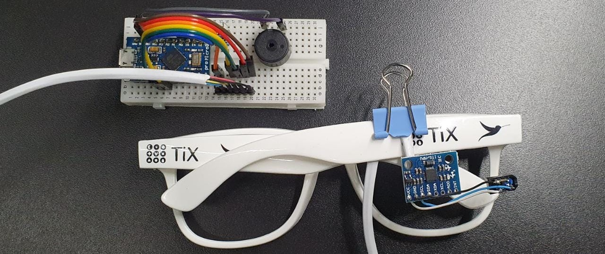
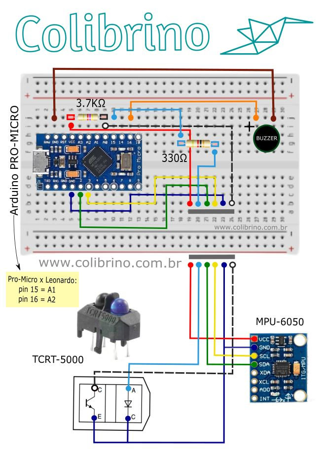

# Colibrino 
Esse é um projeto open-source de uma versão *Faça você mesmo* do nosso mouse de cabeça o Colibri! O objetivo principal dele é promover acessibilidade para pessoas com deficiências físicas do como tetraplegia, artrogripose, amputações e parilisia cerebral.

[Compartilhe sua montagem e suas dúvidas no nosso fórum!](https://groups.google.com/g/colibrino) 

# Índice 

- [Colibrino](#colibrino)
- [Índice](#índice)
- [Licença de Uso](#licença-de-uso)
- [Materiais](#materiais)
- [Montagem](#montagem)
  - [Diagrama Esquemático](#diagrama-esquemático)
  - [Instruções de Montagem](#instruções-de-montagem)
- [Modo de Uso](#modo-de-uso)
- [Plano de Voo 🐦](#plano-de-voo-)
- [Materiais de referência](#materiais-de-referência)

# Licença de Uso
Este programa é um software livre. Você pode redistribuí-lo e/ou
modificá-lo sob os termos da Licença Pública Geral GNU como publicada
pela Free Software Foundation; na versão 3 da Licença, ou
(a seu critério) qualquer versão posterior.

Este programa é distribuído na esperança de que possa ser útil,
mas SEM NENHUMA GARANTIA; sem uma garantia implícita de ADEQUAÇÃO
a qualquer MERCADO ou APLICAÇÃO EM PARTICULAR. Veja a
[Licença Pública Geral GNU](https://github.com/tix-life/Colibrino/blob/master/LICENSE) para mais detalhes.

# Materiais:

|Nome|Especificação|Documentação|
|---|---|---|
|Arduino Leonardo ou Micro Pro|Com Microcontrolador Atmega 32U4|[Pinagem Pro Micro](https://cdn.sparkfun.com/assets/f/d/8/0/d/ProMicro16MHzv2.pdf) [Pinagem Leonardo](https://content.arduino.cc/assets/Pinout-Leonardo_latest.png)|
|MPU6050|Acelerômetro e Giroscópio|[datasheet](https://invensense.tdk.com/wp-content/uploads/2015/02/MPU-6000-Register-Map1.pdf)|
|TCRT 5000|Sensor Infravermelho|[datasheet](https://www.vishay.com/docs/83760/tcrt5000.pdf)|
|Cabo com 6 vias|Ligação entre o Arduino e os Sensores - |[Ex.: cabo para alarme](https://stecondutores.com.br/produto/cabo-de-alarme/)|
|Placa padrão ou protoboard|Base para montagem do circuito||
|Leds|Indicador de piscada e de funcionamento||
|Resistor|1 x 4700Ω a 6800Ω - polarização do fototransistor   1 x 220Ω a 330Ω - restringe corrente do LED IR  1 x 10Ω - atenuar o  buzzer||
|Buzzer|Indicador Sonoro da Piscada||
|Cabo USB|Conexão entre computador e Arduíno||
|Armação de Óculos|Suporte para os sensores||

# Montagem:

## Diagrama Esquemático

## Tabela de Conexões
Nome do Pino no Arduino|Componentes Conectados|Resistor?
|---|---|---|
|VCC (3.3 ou 5V)|MPU-6050 VCC|  |
|VCC (3.3 ou 5V)|TCRT5000 Coletor do Fototransistor| 3500Ω a 5000Ω |
|GND |MPU-6050 GND| |
|GND |TCRT5000 Emissor do Fototransistor| |
|GND |TCRT5000 Cátodo do LED IR (-)|  |
|GND |Buzzer (-)| |
|16 |Buzzer (+)| 0Ω a 10Ω |
|15 |TCRT5000 Ânodo do LED IR (+)| 180Ω a 330Ω |
|A0 |TCRT5000 Coletor do Fototransistor| |

## Instruções de Montagem
1. Conecte o Arduíno, Buzzer, Leds e Resistores no Protoboard. 
2. Para os sensores MPU6050 e TCRT 5000 é necessário solda-los com o fio de 6 vias.
3. Realize as coneções mostradas no diagrama acima.
4. Conecte o Arduíno ao PC usando o cabo USB.
5. Grave o firmware no Arduino usando o [Arduino IDE](https://www.arduino.cc/en/software). No menu "Ferramentas", escolha a opção Arduino Leonardo na lista de placas.
6. Instale o código utilizando o ambiente de desenvolvimento do Arduino devidamente configurado para a placa que está sendo usada.
7. Deixe o Colibrino parado numa mesa sem perturbações até que um beep sonoro indique que ele está pronto para uso (nesse momento ele está calibrando). A calibração é feita apenas uma vez e se não ficar boa (Cursor andando sozinho em alguma direção mesmo o collibrino parado) siga as intruções na seção Calibração.
8. Fixe o sensor MPU6050 em alguma armação de óculos.
9. Use e aproveite. :D
10. [Compartilhe sua montagem e suas dúvidas no nosso fórum!](https://groups.google.com/g/colibrino) 

(montar um painel com imagens)

# Princípios de funcionamento
## Captura do movimento da cabeça
O Colibrino utiliza um tipo de sensor chamado de IMU (Unidade de Medidas Inerciais) para obter informação sobre a orientação espacial da cabeça. A IMU do Colibrino é o MPU-6050, um circuito integrado (acelerômetro + giroscópio) contendo estruturas mecânicas microscópicas capazes de sentir movimentos do corpo preso a ele e a força da gravidade. Essas estruturas mecânicas também interagem eletricamente com o circuito que mede os movimentos em números correspondentes à aceleração e à velocidade angular em três eixos. Os dados são filtrados e utilizados para calcular a posição da cabeça e, por fim, mover o cursor do mouse de forma correspondente.

## Detecção da piscadela
O sensor de piscadelas detecta pequenas variações na reflexão de luz que ocorrem quando uma piscada bem forte é realizada em frente ao sensor. Primeiro a luz infravermelha é emitida por um LED no TCRT5000. A luz é pulsante para que o programa consiga comparar a reflexão com o LED aceso e apagado de forma a compensar variações da luz ambiente. Após ser refletida, a luz é captada por um fototransistor que converte a intensidade da luz em um sinal elétrico medido pelo Arduino.

## ⚠️ Calibração

A calibração efetuada após a primeira gravação do programa no colibrino é feita apenas uma vez. Contudo ela pode falhar devido a movimentações no colibrino durante o processo de calibração, levando a um mau funcionamento do aparelho. Para resolver isso , grave o código LimparCalibração que está dentro da pasta baixada e regrave o código principal mais uma vez. Isso levará o Colibrino para a mesma fase inicial de calibração, repita o procedimento de esperar até que o tempo de calibração conclua.

# Modo de Uso
Com o colibrino devidamente montado para usá-lo basta mexer a cabeça com o oculos que está instalado o sensor. Contudo, segue abaixo uma lista de orientações.

1. O Sensor MPU6050 deve estar colocado no óculos que vai ser usado, porém o TCRT deve estar conectado somente ao fio permitindo o ajuste.
2. Para melhor detecção da piscadela é necessário mexer o fio que o sensor TCRT está conectado para mais próximo ao olho.

(explicar como que usa o colibrino - como posicionar e ajustar o sensor)

# Plano de Voo 🐦
Existe inumeras funções que podem ser adcionadas ao Colibrino e algumas que estão no plano de voo da nossa equipe são:
* Scroll ao inclinar a cabeça para os lados
* Funções com gestos da cabeça

Estamos abertos a sugestões e feedbacks a todos :D 
Agradecemos a leitura <3

# FAQ
* Dúvidas frequentes anexadas no documento abaixo: https://docs.google.com/document/d/1n8rUOnNmSkuknlO98TbDd7EEdKiDvEBH_lRSuz5WyO0/edit?usp=sharing

# Materiais de referência:
* https://www.youtube.com/watch?v=4sIkW7wogrE
* https://github.com/witnessmenow/arduino-switcheroonie/blob/master/BLE-switcheroonie/BLE-switcheroonie.ino
* https://github.com/T-vK/ESP32-BLE-Mouse
